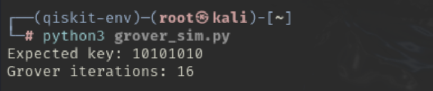
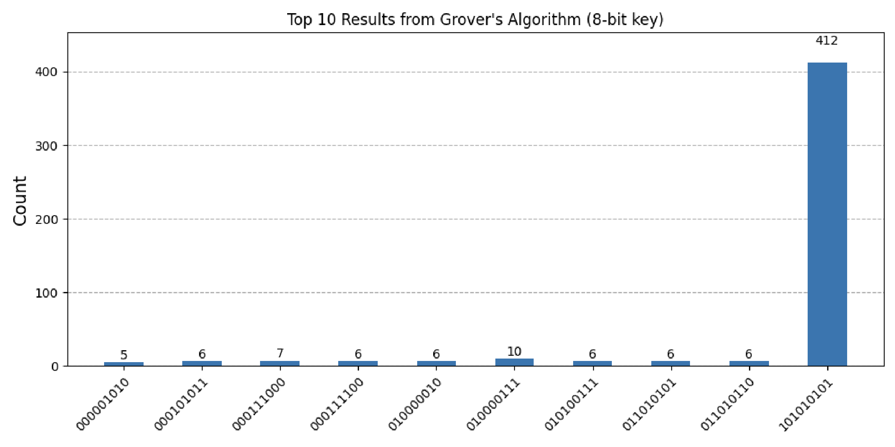
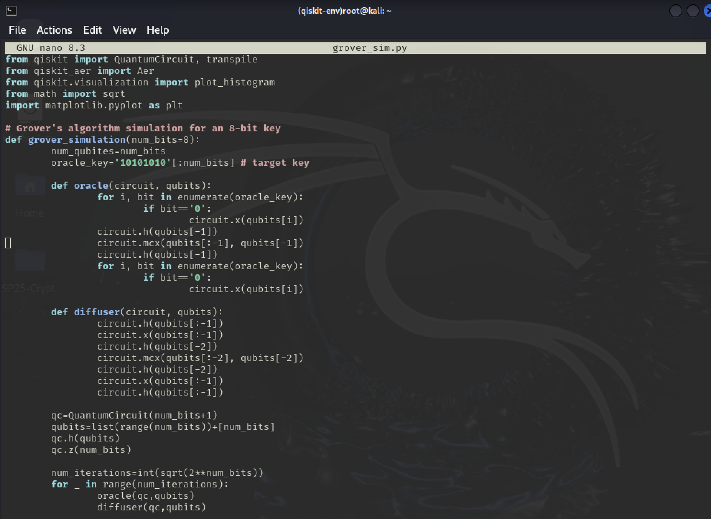
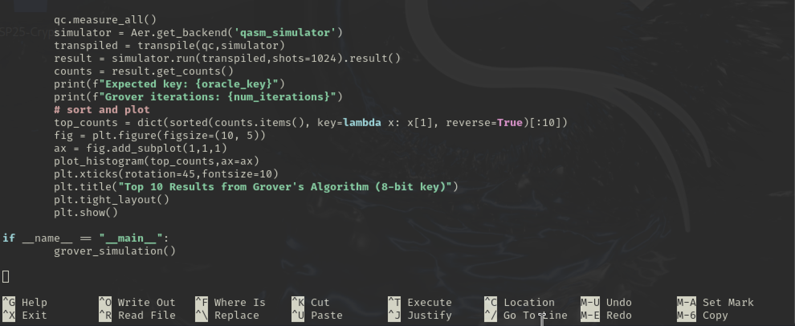

# AI & Quantum Security Analysis of HBEA (Integrated Report)

**Author**: Hanna Chang  
**Course**: MADR-CS 281 — Intro to Cryptography and Computer Security  
**Project**: Final Report — Hybrid Block Encryption Algorithm (HBEA)  
**Date**: Spring 2025  

---

## 1. Algorithm Recap: HBEA Structure

HBEA is a custom 256-bit block encryption algorithm designed for educational purposes to explore hybrid cryptographic ideas.

### Key Components:
- **Key Generation**:
  - SHA-256 hash of the user's email.
  - Split into eight 32-bit segments, used as subkeys.
- **Initial Permutation (IP)**:
  - Based on the ASCII sum of the email to create a deterministic but user-specific permutation.
- **Block Processing**:
  - Plaintext is chunked into 32-bit blocks.
  - Each block undergoes:
    - **Expansion** (DES-style from 32 to 48 bits).
    - **S-box substitution** (non-invertible, reduces back to 32 bits).
    - **XOR with key segment**.
- **Output Format**: Encrypted binary is converted to hexadecimal.
- **Decryption**: Not fully supported due to the non-invertibility of the expansion/S-box steps.

---

## 2. Performance & Feature Benchmark: HBEA vs AES-256

| Feature                    | AES-256                        | HBEA                                         |
|---------------------------|--------------------------------|----------------------------------------------|
| Block Size                | 128 bits                       | 256 bits                                     |
| Key Size                  | 256 bits                       | 256 bits (from SHA-256 hash)                 |
| Rounds                    | 14                             | 1 round (8 segments in parallel)             |
| Substitution              | AES S-box                      | DES-style S-box (8 total)                    |
| Permutation               | Fixed permutation              | Email-based dynamic permutation              |
| Decryption                | Fully reversible               | Partially (non-invertible S-boxes/expansion) |
| Padding                   | PKCS#7 or others               | ❌ Not implemented                            |
| Mode of Operation         | CBC, ECB, GCM, etc.            | ❌ None used                                  |
| Quantum Resistance        | 2^128 (Grover)                 | Estimated 2^128 (Grover)                     |
| NIST Compliance           | ✅ Yes                         | ⚠️ Partial                                    |

---

## 3. Quantum Attack Simulation with Qiskit

We implemented Grover’s algorithm in Qiskit to simulate a quantum attack on an 8-bit version of HBEA for educational demonstration.

### Execution Output (Kali Linux):

- **Expected key**: `10101010`
- **Grover iterations**: 16 (i.e., √2⁸)

### Output Visualization:

The histogram below shows the frequency of each observed result from 1024 trials. As expected, the key `10101010` was returned most frequently (412 times), verifying Grover’s quadratic speedup over classical brute force.

### Grover's Algorithm Code (Python):

### Interpretation:

Grover’s simulation successfully located the expected key with high probability, confirming the algorithm’s effectiveness. In a real 256-bit implementation, Grover would still need ~2^128 operations, equating HBEA's quantum resistance to that of AES-256.

---

## 4. NIST Compliance & Security Analysis

| Criterion               | NIST Recommendation                  | HBEA Evaluation                              |
|------------------------|--------------------------------------|----------------------------------------------|
| Key Size               | ≥ 128 bits                           | ✅ 256 bits                                   |
| Key Generation         | Entropy or secure KDF                | ⚠️ SHA-256 of email (predictable input)      |
| Randomness             | Cryptographically random values      | ⚠️ Deterministic from email                  |
| Permutation            | Strong/confusion-inducing            | ✅ Dynamic, but deterministic                 |
| Reversibility          | Required for decryption              | ❌ S-box and expansion are not reversible     |
| Padding & Modes        | Required for multi-block security    | ❌ Not implemented                            |
| Key Management         | Secure key storage/distribution      | ❌ Not addressed                              |

### Vulnerabilities
- Deterministic inputs (key, permutation) → **predictable output**
- Incomplete decryption capability → **not invertible**
- No IV or chaining → **pattern leakage**
- No padding → **fixed block vulnerabilities**
- No key handling policy → **deployment risk**

---

## 5. Tools & Environment

- **Python 3.12**
- **Qiskit** (`qiskit`, `qiskit-aer`)
- **Matplotlib** (Grover histogram)
- **Kali Linux** (Python virtualenv for testing)
- **Jupyter Notebook** (HBEA code implementation & testing)
- **ChatGPT** (debugging support & report drafting)

---

## 6. Final Remarks

HBEA is a solid educational cipher combining classical cryptography and quantum-resilient concepts. While it shows promising structural elements, it lacks production-grade reversibility, randomness, and compliance with NIST’s robust encryption standards.

**Next Steps for Improvement**:
- Implement secure KDFs and non-deterministic key derivation
- Add padding, IV, and secure modes like CBC or GCM
- Make transformation steps invertible for real-world use
